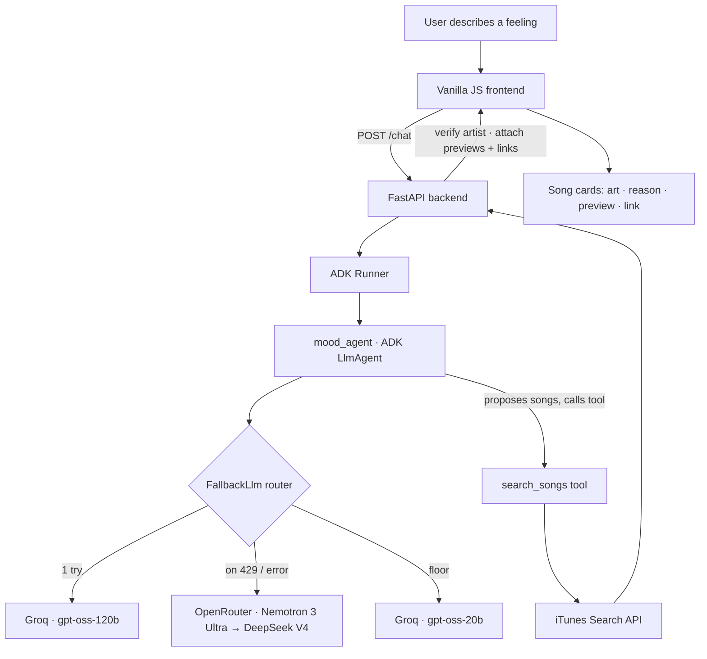

# 🎵 Moodtune

**Tell it how you feel or what's going on, and it finds real, playable songs that fit the moment.**

🔗 **Live demo:** [moodtune-b6y8.onrender.com](https://moodtune-b6y8.onrender.com)
*(Hosted on a free tier — the first request after it's been idle can take ~30–50s to wake up.)*

📦 **Repo:** [github.com/RitulVashistha-IITD/music-mood-agent](https://github.com/RitulVashistha-IITD/music-mood-agent)

<!-- Add a screenshot: drop an image into the repo (e.g. docs/screenshot.png) and update the line below -->
<!--  -->

---

## What it is

Moodtune is an AI agent that reads a described feeling or situation — *"anxious about my career and my future,"* *"angry at my brother,"* *"excited for the weekend"* — interprets the underlying emotion **and context**, and recommends a few real songs whose lyrics genuinely fit. Each recommendation comes with cover art, a one-line reason it fits, a **30-second preview you can play right in the browser**, and a link to the full track.

It's built on **Google's Agent Development Kit (ADK)** and runs **entirely on free infrastructure** — no paid APIs, no credit card.

---

## Why it's more than an LLM wrapper

Any chatbot can name a few songs from memory. The engineering that makes this a real product is everything that makes those suggestions **trustworthy, playable, and resilient**:

- **Grounded, not hallucinated.** The model proposes candidate songs, but nothing is shown until the backend verifies each one against a real music catalog (Apple's iTunes Search API). A song that can't be verified is dropped — never faked.
- **Artist-match verification.** Small models often misattribute songs to the wrong artist. The backend confirms the returned track's artist actually matches the claim before it reaches the user, killing the "card says one artist, plays another" failure mode.
- **A custom multi-provider fallback router.** The agent's "brain" is a hand-written [`FallbackLlm`](mood_agent/fallback_llm.py) that subclasses ADK's `BaseLlm`. It routes each request through an ordered chain of models across two providers and, on any rate-limit or error, silently falls through to the next — so the app stays up even when a provider's free quota is exhausted.
- **Graceful degradation.** When every free model's daily limit is spent, the user gets a friendly, in-character message instead of an error page.
- **Structured output → a real interface.** The agent returns validated JSON, which the backend enriches with verified links and previews and renders as responsive song cards (light/dark theme, single-track audio playback).

---

## Architecture



**One request, end to end:** the browser sends the situation to FastAPI → the ADK Runner invokes the agent → the agent reasons through the `FallbackLlm` router (trying each free model in order) → it proposes songs and calls the `search_songs` tool → the tool hits the iTunes catalog → the backend verifies the artist matches and attaches real previews/links → the frontend renders playable cards.

---

## Tech stack

| Layer | Choice |
|---|---|
| Agent framework | Google Agent Development Kit (ADK) |
| Model routing | Custom `FallbackLlm` (subclass of ADK `BaseLlm`) + LiteLLM |
| Models (free tiers) | Groq `gpt-oss-120b` / `gpt-oss-20b`, OpenRouter Nemotron 3 Ultra & DeepSeek V4 Flash |
| Grounding / data | Apple iTunes Search API (no key, exact links + 30s previews) |
| Backend | FastAPI + Uvicorn |
| Frontend | Vanilla HTML / CSS / JavaScript (no framework) |
| Deployment | Render (free tier), continuous deploy on push to `main` |

---

## Key design decisions & tradeoffs

These are the choices I'd actually talk through in a review:

**1. Retrieve-and-verify beats generate-and-trust.**
The first version let the model both *pick* songs and *write the links* — which meant hallucinated tracks and dead URLs. The fix was to make the model do only what it's good at (judging which songs fit a feeling) and let the backend own all facts: existence, artist, links, previews. The model never emits a URL.

**2. Grounding a small model is harder than prompting a big one.**
A frontier chatbot "wins" at raw song matching partly because it's allowed to be confidently approximate — it never has to prove a track is real. This app deliberately does the harder, more useful thing, which is why verification (and honestly returning *fewer but correct* songs) matters more than clever prompting.

**3. Availability vs. quality is a routing problem.**
Running fully free means juggling providers with different quota windows (OpenRouter's ~50/day resets on a daily boundary; Groq's ~1,000/day plus a per-minute cap). The fallback router turns "which model do I use?" into a solved, automatic decision. The chain is quality-ordered but starts with the highest-throughput model during development to conserve the scarcer, higher-quality quota — a one-line switch depending on whether I'm optimizing for a demo or for iteration.

**4. Fail like a person, not a stack trace.**
Quota exhaustion is expected on free infra, so it's handled as a first-class path with a friendly message rather than a 500.

---

## Running locally

**Prerequisites:** Python 3.10+ (built on 3.11).

```bash
# 1. Clone and enter
git clone https://github.com/RitulVashistha-IITD/music-mood-agent.git
cd music-mood-agent

# 2. Create and activate a virtual environment
python3 -m venv .venv
source .venv/bin/activate        # Windows: .venv\Scripts\activate

# 3. Install dependencies
pip install -r requirements.txt
```

Create `mood_agent/.env` with your free API keys:

```
GOOGLE_GENAI_USE_VERTEXAI=FALSE
OPENROUTER_API_KEY=your_openrouter_key
GROQ_API_KEY=your_groq_key
```

- Groq key (free, no card): [console.groq.com](https://console.groq.com)
- OpenRouter key (free, no card): [openrouter.ai](https://openrouter.ai)

Run it:

```bash
uvicorn main:app --reload --port 8001
```

Open **http://localhost:8001**.

---

## Project structure

```
music-mood-agent/
├── main.py                 # FastAPI app: /chat endpoint + serves the frontend
├── requirements.txt
├── static/                 # Frontend (served by FastAPI)
│   ├── index.html
│   ├── styles.css
│   └── app.js
└── mood_agent/             # The ADK agent
    ├── __init__.py
    ├── agent.py            # Agent definition, model chain, instructions
    ├── fallback_llm.py     # Custom multi-provider fallback router
    ├── tools.py            # search_songs — grounds picks in a real catalog
    └── .env                # API keys (git-ignored)
```

---

## Limitations & honest notes

- **Recommendation quality is bounded by free models.** For very niche or specific-artist requests, recall is imperfect — the agent is designed to broaden gracefully and stay honest rather than force a bad match.
- **Free-tier quotas are real.** Heavy use in a short window can exhaust all providers for the day; the app says so plainly.
- **First load is slow** on Render's free tier (it sleeps when idle).
- This is a **learning project** focused on agentic engineering, not a production service.

---

## What I'd build next

- **Best-available routing:** track which models still have quota today and always route to the best one that isn't exhausted, instead of a fixed order.
- **Per-user memory:** learn a listener's taste from thumbs-up/down feedback and feed it back into recommendations.
- **An evaluation harness:** measure recommendation quality systematically (relevance, artist-match rate, playable-link rate) and gate changes on it.

---

*Built as a one-day deep-dive into agentic AI — from a blank machine to a deployed, grounded, multi-provider agent.*
